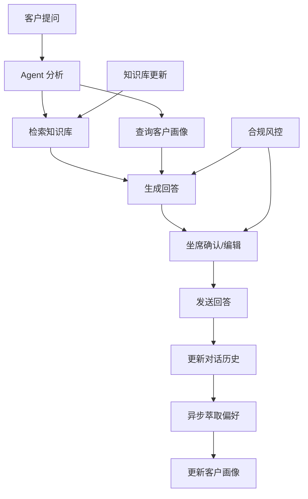

## 14. 客服坐席端

- **定位**：面向银行内部客服坐席的对话界面。承接客户发起转人工请求后的回复对话。
作为“人机协作”的最后一公里，它承载了从知识检索、合规风控到业务办理的全部流程。该界面不仅是坐席的“大脑”，更是银行服务质量的直接体现。

### 14.1 核心交互模式
- **人机协作 (Human-in-the-Loop)**：
  - **AI 辅助**：Agent 优先使用 AI 生成回答，并实时显示置信度分数。
  - **人工干预**：坐席可随时编辑 AI 生成的内容（如调整语气、修正事实），或直接输入人工回答。
  - **双向学习**：坐席的编辑操作和最终发送内容会被系统捕获，用于持续优化 Agent 的知识库和回答策略。

### 14.2 界面布局与功能模块

#### 14.2.1 左侧边栏
- **会话管理**：
  - **会话列表**：展示当前坐席正在处理的所有会话。
  - **会话切换**：支持快速切换会话，无缝衔接不同客户。
- **知识库导航**：
  - **动态分类**：根据坐席的 `dept_code`（业务条线）和Query相关业务推测动态加载知识库分类。
  - **快捷入口**：高频查询的知识点置顶展示。

#### 14.2.2 聊天主窗口 (Chat Window)
- **消息流**：
  - **AI 消息**：显示 AI 生成的回答，包含置信度分数（如 95%）和引用来源（可点击追溯）。
  - **人工消息**：坐席手动输入的回答。
  - **系统消息**：显示 Agent 执行的工具调用（Tool Calls）和系统提示（System Prompts）。
- **交互工具栏**：
  - **编辑模式**：切换 AI 回答的编辑状态。
  - **一键追问**：针对 AI 回答中的某个点，快速生成追问语料。
  - **知识库直链**：点击消息中的关键词，直接跳转到相关知识库页面。

#### 14.2.3 知识库面板 (Knowledge Panel)
- **实时检索**：
  - **同步搜索**：当坐席在聊天框输入时，知识库面板实时显示相关搜索结果。
  - **多源聚合**：整合 `product_kb`, `policy_kb`, `process_kb` 等多个来源。
- **内容展示**：
  - **结构化内容**：产品参数、政策条文等结构化信息直接展示。
  - **AI 摘要**：复杂文档提供 AI 生成的摘要和要点。
  - **版本管理**：显示知识的生效日期和版本号，确保合规性。

#### 14.2.4 客户画像面板 (Customer Profile Panel)
- **静态信息**：
  - **基本资料**：姓名、年龄、性别、常住地（来自 `basic_profile`）。
  - **客户等级**：大众散客、金葵花、私行等（来自 `cust_tier_level`）。
- **动态画像**：
  - **风险偏好**：R1-R5 等级（来自 `risk_tolerance_level`）。
  - **持仓标签**：`has_mortgage`, `has_credit_card` 等（来自 `holdings_tag_flags`）。
  - **隐式偏好**：从历史会话中提取的偏好（来自 `extracted_preferences`）。

#### 14.2.5 操作与风控面板 (Action & Risk Panel)
- **工具调用区**：
  - **工具列表**：展示 Agent 可用的所有工具（如 `query_product`, `check_eligibility`）。
  - **执行状态**：显示工具的执行结果和参数。
- **合规风控区**：
  - **敏感词检测**：实时检测坐席输入和 AI 回答中的敏感词。
  - **合规预警**：
    - **私行产品预警**：当客户为大众客户但 AI 推荐私行产品时触发。
    - **风险不匹配预警**：当客户风险承受力与产品风险等级不匹配时触发。
  - **强制兜底**：预警触发时，系统强制插入预设的合规话术。

### 14.3 核心业务流程

#### 14.3.1 坐席登录与权限初始化
1. **登录认证**：坐席输入工号和密码。
2. **权限加载**：系统根据 `emp_id` 加载 `dept_code`, `job_title`, `branch_region` 等信息。
3. **知识库预热**：根据 `dept_code` 加载对应的知识库分类，并预加载高频查询。

#### 14.3.2 对话交互流程
1. **用户提问**：客户提出业务问题。
2. **Agent 分析**：
   - **检索**：从 `product_kb`, `policy_kb` 中检索相关信息。
   - **决策**：根据客户画像（`cust_tier_level`, `risk_tolerance_level`）和业务规则，生成回答。
3. **坐席确认**：
   - **AI 推荐**：Agent 生成回答并显示置信度。
   - **人工编辑**：坐席可编辑回答内容。
   - **发送**：坐席发送最终回答。
4. **知识库更新**：
   - **实时更新**：坐席的编辑内容实时更新到 `dialogue_history`。
   - **异步萃取**：后台任务定期从 `dialogue_history` 中提取新的隐式偏好，更新 `extracted_preferences`。

#### 14.3.3 合规风控流程
1. **敏感词检测**：
   - **触发**：坐席或 AI 回答中包含敏感词（如“私密账户”、“大额转账”）。
   - **动作**：系统拦截消息，显示敏感词警告，并提供替换建议。
2. **私行产品预警**：
   - **条件**：`cust_tier_level` != "私行" 且 回答中包含私行产品信息。
   - **动作**：
     - 弹出强制弹窗，显示预设的合规话术。
     - 坐席必须确认已阅读并理解合规风险后才能继续。
3. **风险不匹配预警**：
   - **条件**：`risk_tolerance_level` 为保守型（R1-R2）且 回答中包含高风险产品。
   - **动作**：
     - 降低 AI 回答的置信度。
     - 在知识库面板中高亮显示更保守的替代方案。

### 14.4 数据流转

### 14.5 技术实现要点

#### 14.5.1 动态权限控制
- **基于角色的访问控制 (RBAC)**：
  - `dept_code` 决定了默认访问的知识库范围。
  - `job_title` 决定了操作权限（如是否可执行高风险操作）。
- **动态路由**：
  - 根据 `dept_code` 动态配置 RAG 管道的检索源。

#### 14.5.2 实时反馈机制
- **置信度计算**：
  - `confidence = (retrieval_score * 0.4) + (llm_coherence_score * 0.4) + (risk_compliance_score * 0.2)`
- **编辑追踪**：
  - 使用 `MutationObserver` 监听聊天消息的 DOM 变化。
  - 捕获编辑前后的文本，计算差异，用于增量学习。

#### 14.5.3 知识