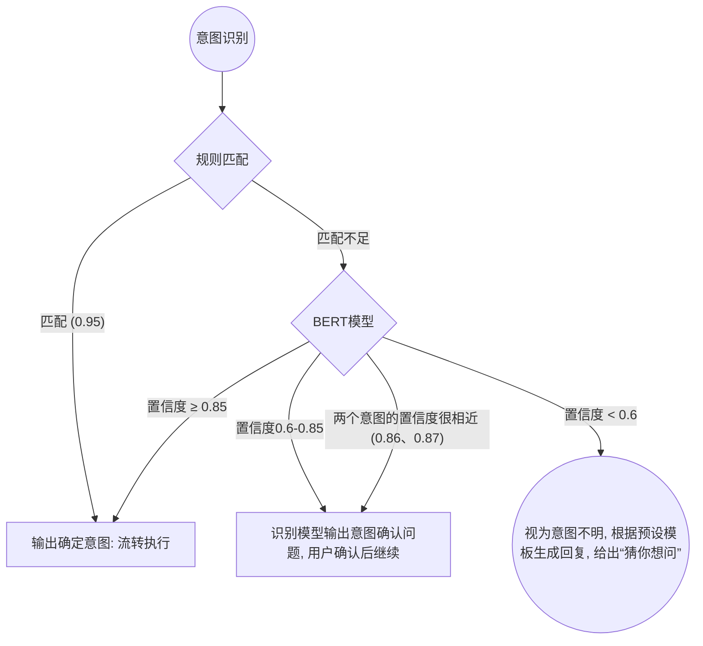

# 1. 开发版本及文档修订记录
- 版本号：v0.8.0
- 版本描述：
- 产品经理：--
- 交互/UI: --;--
- 交互稿url:
- UI稿url:

|版本|修订人|修订说明|目醮|批准人|修改日期|
|:---|:---|:---|:---|:---|:---|
|0.8.0.0|--|--|--|--|--|

# 2. 业务背景及目标
## 2.1 业务背景
随着我行各业务线的快速扩张，产品迭代频率与业务复杂度呈指数级增长。目前，行内外在信息获取上面临以下痛点：

### 对外客户端：“关键词陷阱”导致体验不佳
我行现有客服系统为传统的“关键词匹配”系统，回答客户问题时语言机械、略显笨拙。当客户表达口语化时，系统往往无法准确命中，导致频繁跳转人工。高峰期坐席排队严重，人工客服压力大，内部信息查找效率低，客户流失率高。

### 技术趋势：从“死记硬背”到“理解意图”
当下人工智能发展迅速， 大语言模型（LLM）的爆发及RAG（检索增强生成）等技术的成熟，为金融领域解决“语义理解”与“知识溯源”提供了技术方案，使得构建一个既懂业务又能通俗回答，还能智能操作，生成报告的智能系统成为可能。
头部产品支付宝、蚂蚁财富等已上线基于AI技术的服务系统，银行中招行已上线AI客服系统。其他银行如江苏银行等也在部署相关系统。

### 内部员工端：“知识孤岛”造成作业效率低下
银行内部规章制度、产品手册分布在不同的内网系统及PDF文档中。新入职的柜员或客户经理在面对复杂咨询时，往往需要翻阅大量文档或口头询问老员工，这不仅增加了老员工的带教负担，也极易因信息获取滞后导致合规风险。

### 系统性报告生成耗时长
在实际业务中，资产配置方案、保险配置方案、信贷方案等系统性报告，需要查阅大量资料和客户财务数据等信息，耗费大量人力物力，且报告质量参差不齐。如果能借用AI生成能力，可以大量减少人工的重复劳动，使其有更多精力拓展新客户，提升客户体验。

## 2.2 目标

### 一期目标
- 赋能员工（对内）
  - 实现零售业务知识的语义检索与自动总结，提升问题命中率、解决新员工“问询难”的问题，降低培训成本。
  - 将内部信息的检索覆盖度提升，确保所有回答均能溯源至行内官方文档。
  - 建立自动化的Badcase收集机制与纠错反馈机制，形成数据闭环。
  - 持续优化QA知识库、元数据与标签体系，提升响应速度。
- 关键指标
  - 意图识别有效命中率：80%以上
  - 检索命中率（QA+知识库）：70%以上
  - 内部员工满意度 85% 以上。

### 二期目标[根据一期结果变动]
- 提升对客服务效能（对外）
  - 将客户问题的意图识别有效命中率提升至 85% 以上。
  - 显著提升客户自助解决率，预计降低人工坐席分流压力 30%-40%。
- 工具调用开发
  - 完成可调用工具至少10个
- 报告生成开发
  - 内部行员端报告下载率：50%以上
  - 外部客户端报告下载率：10%以上

# 3. 产品定位
**银行AI智能客服助手** 是基于大语言模型构建的新一代智能客服系统。整合知识问答、数据查询、业务操作与报告生成四大核心能力。
- **对内**：面向行内业务员、柜员、客服坐席等内部员工，提升信息获取效率、辅助决策分析与客户服务能力。
- **对外 [二期]**：升级现有App、小程序、网上银行等端口中的客服系统，实现从“关键词匹配”到“语义理解”、“智能办理”的跨越，提供便捷、智能、个性化的咨询和服务办理体验。


# 3. 竞品分析
主要对标行业内领先金融机构的AI员工与智能客服（如招商银行“小招”、工商银行“数字人客服”等）以及通用型RAG产品（如各大厂政企私有化部署的大模型知识库方案），相比传统客服，本质区别在于：

1. **意图理解能力的代差**：摆脱僵化的话术树。
2. **知识范围的广度**：不仅支持结构化的QA对，也能支持直接读取PDF、Word业务操作手册的内容。

# 4. 产品架构


# 5. 知识库文档处理

一期工程仅收录“个人业务”和“各应用操作手册”的各类文档作为知识库。文档处理流程各节点细节请见[AI智能客服问答系统_管理系统.md](管理系统.md)中的相关章节。

# 6. Query预处理

## 1. 多模态Query文本提取

  各端口均支持用户Query的多模态输入，包括文本、图片、语音，不包括视频和其他文档。
  各模态query的处理：

  | 模态 |                   处理方式                    |            url             | APIkey |
  |:----:|:---------------------------------------------:|:--------------------------:|:------:|
  | 文本 |               直接输入至下一步                |
  | 图片 |    识别工具：Paddle-OCR，提取文字作为query    | <http://127.0.0.1:8000/api/> |   --   |
  | 语音 | 识别工具：SenseVoice Small，提取文字作为query | <http://127.0.0.1:8000/api/> |   --   |

## 2.关键词提取

  根据上一步输入的query，提取关键词。

## 3.Query风险监测与反洗钱拦截

  根据上一步抽取的关键词和原始Query字符串，分两层进行风险匹配隔离：

  **(1) 单关键词触发**

- **黑词库枚举**：`洗钱`、`跑分`、`买卖银行卡`、`租借U盾`、`地下钱庄`、`逃汇`、`转移资产`、`伪造流水`、`代开收入证明`、`公账私转`、`修改征信`、`套现`。
- **匹配逻辑**：一旦从用户Query中命中上述确切的高危黑词，立即触发风险拦截。

  **(2) 正则特征组合**
  - 针对边缘口吻的金融违规操作指引（如骗贷、诈骗中介、非法套现等灰色地带），使用正则表达式圈定特征：

  1. **信用卡套现行为**：禁止指导非法变现操作。
       - **正则式**：`(信用卡|贷记卡|准贷记卡).*?(怎么套现|刷出来用|TX|弄出现金)`
  2. **规避外汇与大额监管**：禁止指导拆分转账等规避操作。
       - **正则式**：`(怎么躲开|如何规避|绕开).*?(反洗钱|限额|监管|大额(上报|监控))`
  3. **电诈涉赌及异常中介**：拦截有洗钱嫌疑的请求。
       - **正则式**：`(帮(人|朋友)|代(人|朋友)).*?(转账|汇款|开户|办卡|走流水)`
  4. **虚拟货币涉非交易**：中国大陆明令禁止为虚拟币提供支付结算或兑换。
       - **正则式**：`(USDT|泰达币|比特币|炒币).*?(怎么(买|卖)|充值|入金|转账)`
  
  **(3) 拦截系统响应与分发动作**

- **模型阻断强制接管机制**：命中上述任意防线后，后续流程放弃，返回标准拒答话术：
  - “*您的提问疑似涉及违规资金操作或敏感信息，为保障金融安全，本系统无法为您提供该类协助解答。*”
- **风控留痕（预警打标）**：系统在拒绝提供答案的同时，在后台抽取触发此拦截逻辑的客户端设备ID、用户ID，连同完整的Query历史原文写入风控合规日志，并推送至总行“反欺诈/反洗钱监控中心”进行高危账户打标预警。

## 4.缓存检索（一期工程暂时不做）

  **一期工程暂不建立缓存机制**。二期工程将建立高频问题语义缓存库响应毫秒级并发查询。

## 5.Query改写逻辑

### 改写前置判断机制 (是否触发改写)

为了降低大模型并发改写带来的高额Tokens开销及系统延迟，在进入正式的大模型改写前，执行一套**“是否需要改写”**的两层路由判断机制。

#### 第一层：规则匹配（正则/词典）

一旦命中以下任意一条规则，刻判定为需要去补全，进入改写重构流程；若均未命中，则进入第二层判定。

1. **含有明显指示代词**
   - **词典特征**：`它`、`这个`、`那个`、`这几个`、`那里`、`他`、`她`、`这些`、`那些`、`其` 等。
2. **含有模糊/口语化疑问词汇**
   - **词典特征**：`怎么弄`、`怎么办`、`好用吗`、`啥意思`、`然后呢`、`能不能再详细点` 等。
3. **文本基础质量低/缺乏主干**
   - **特征占比异常**：正则检测发现纯中文、字母和数字的有效信息提取率小于50%（如全为特殊符号 `？？？` 或无意义乱码 `asasda`）。
   - **字符长度受限**：Query全文长度极短（如 ≤ 2 个字符，如“利息”、“对吗”），通常在追问场景频繁出现，需改写以补全主语。
4. **多轮对话判断**
   - **时间轮次阈值判断**：若当前提问最后一次消息发送时间间隔在 **10分钟（600秒）以内**，即认为未超时，属于“多轮连续对话语境”。因具有极大概率的跟问属性，一律纳入触发改写。
   - **历史承接关键词触发**：用户文本中显式包含了追溯历史的特征词块，例如：`前面`、`刚刚说了`、`上一条`、`刚才所述`、`像上面说的` 等。

#### 第二层：小型NLP分类模型校验（可能不做）

为避免第一层正则防线出现漏网之鱼（如缺少代词但包含强业务省略句），使用轻量级分类模型判断是否需要改写（FastText或者小语言模型）。

- **Prompt** 请见：[改写判断Prompt.md]

**分发流转结论**：

- 模型若输出 `True`：流转至改写流程；
- 模型若输出 `False`：表示该句话属于结构确切的标准独立 Query，跳过改写步骤，进入意图识别模块

### 改写执行

如果Query需要改写，则进入改写流程，模型选择：Qwen-7B-Instruct

- 如果当前Query处于多轮对话中，则需要获取用户最近的5条对话记录作为上下文（Context）。
- **Prompt** 请见：[Query改写Prompt.md]

# 7. 意图识别

## 意图体系构建

根据系统远期规划构建意图体系，除满足一期工程【个人业务】、【各端口操作说明】的RAG检索外，还需考虑其他业务的检索和数据查询。详细请见：[意图体系.csv]（7_意图体系.csv）

## 识别判断

采用“规则先行，BERT模型兜底”的混合双层判断模式，通过置信度阈值分流，实现“高分秒批、中分澄清、低分兜底”。



### 第一层：规则引擎初筛

- **匹配机制**：根据改写后的Query，提取关键词，与意图名称相匹配。
- **流转动作**：
  - **匹配成功**：关键词覆盖率 `≥ 0.95` 时，即跳过BERT模型，直接判定意图并向后流转。
  - **匹配不足**：关键词覆盖率 `＜ 0.95` 时，进入第二层BERT模型进行意图识别。

### 第二层：BERT意图识别模型

对未能在第一层规则中匹配的Query，进入BERT意图文本分类模型。基于置信度打分，执行动态流转：

| 模型选择           | url              | APIkey |
|--------------------|------------------|--------|
| Qwen-1.8B-Instruct | <http://localhost> | --     |

1. **直通执行（高置信度）**
   - **前提基准**：模型输出的首选意图置信度 **`≥ 0.85`** 。
   - **响应结果**：将输出的意图识别结果流转至下一步骤。
2. **意图澄清与阻断反问（中等或模糊）**
   - **条件 A**：模型输出的各个结果置信度分值均不高，在 `0.6` 和 `0.85` 之间。
   - **条件 B**：模型发生判别困难。排名最高的第一、第二意图置信度分值差值小于0.02且`≥ 0.85`（比如 `0.87` 和 `0.86`）。
   - **响应结果**：引发**澄清反问（Clarification）**动作。依据识别出的候选项，模型自动推送至对话流问题选择卡片。
   形式如下：（取"predicted_intent_level2"字段）
      - 请问您是想：
        - 查询房贷按揭记录？（按钮）
        - 查询消费贷记录？（按钮）
      - 待接收到用户按钮重新勾选确认后再完成执行闭环。

3. **意图不明拦截（低置信度）**
   - **前提基准**：最高的识别结果排位预测置信度仍然 **`< 0.6`**。
   - **响应结果**：判定“无法理解/意图不明”。依据预先设计的缺省兜底标准话术委婉致歉回复并告知未能理解。并在对话流末端推送 **“猜你想问”**。此处 **“猜你想问”** 由改写后的Query，提取关键词，检索QA库给出，关键词覆盖率`≥ 0.5`，取Top3。如果检索不到，则使用首页的“猜你想问”填充。

意图识别模型Prompt请见：[意图识别Prompt.md]

# 8. 路由Router
本模块采用双层分发架构，承接上游的意图识别结果，决定最终的交互处理路径。
## 8.1 第一层：基于意图规则
- **逻辑说明**：根据上一步骤意图识别输出的确切“一级/二级意图名称”，执行确定性的规则分发。
- **流转动作**：对应意图与归属 RAG 流程或 Agent 处理的映射承接动作详见：[意图体系.csv]，此处不再复述。

## 8.2 第二层：小模型动态决策兜底
- **触发条件**：如果第一层按照意图未能在规则表内找到确切对应的路由处理路径（例如前置意图被判为闲聊、识别失败，或属于复杂的跨界组合问题），则流转至此由轻量级分类模型兜底判断。
- **输出分流节点**：模型将动态决策把 Query 路由至以下三条通道之一：
  1. `Search_Knowledge_Base` (流向知识库做RAG问答)
  2. `Call_Agent_Tool` (流向Agent挂起执行动作或反查数据)
  3. `Chit_Chat_Fallback` (定性为非业务意图，直接闲聊兜底)
- **模型选型**：Qwen-1.8B-Instruct (或同级别低延迟蒸馏模型)
- **Prompt结构参考**：相关决策指令请见：[路由决策Prompt.md](8_路由决策Prompt.md)

# 9.知识库查询流程

## 基于改写后的Query检索缓存Redis（一期暂无）

- 若路由节点判断对应承接动作为知识库查询，则先根据改写后的Query提取关键词，检索Redis缓存，关键词覆盖度`≥ 0.9`，则直接返回Redis中的答案，否则进入下一步骤。

## 检索QA库

将改写后的Query向量化，检索QA库（根据意图体系判断检索哪一个QA库），根据相似度，执行动态流转：

1. **相似度≥0.9**，直接返回QA答案，中止生成流程。
2. **相似度≥0.85且<0.9**，输出此区间的QA库问题（最多3个），请用户确认。形式如下：

```Markdown
   - 请问您是想问：
     - QA库问题1（按钮）
     - QA库问题2（按钮）
     - 以上都不是
```

- 若用户点击“QA库问题1”或“QA库问题2”，则直接返回对应的答案，中止生成流程。
- 若用户点击“以上都不是”，则进入下一步骤。

1. **相似度<0.85**，则进入下一步骤。

## 检索知识库（混合检索）

若以上步骤均未返回答案，则进入知识库混合检索流程。根据意图体系判断检索哪一个知识库，以及检索范围。

### 1. 语义向量检索

- 将改写后Query的向量与Chunk向量比较余弦相似度，Chunk召回条件：
  - **相似度≥0.8**
  - 元数据`confidentiality`（保密程度）与用户身份符合
  - 在满足以上条件基础上，取 **Top3**。
- 召回方式：在前述知识库搭建中，已经采用了父子级结构，因此在召回时，根据Top3的`Chunk_ID`，向上追溯其父级`Block_ID`，将父级Block的内容也一并召回。

### 2. 关键词检索

- 通过改写后的Query，提取关键词，通过关键词检索（Elasticsearch），Chunk召回条件：
  - **关键词覆盖度≥0.9**
  - 元数据`confidentiality`（保密程度）与用户身份符合
  - 在满足以上条件基础上，取使用BM25算法打分排序后 **Top3**的Chunk。
- 召回方式：仅召回本级Chunk。

### 3. 召回数量不足的措施

- 若召回Chunk数量<1，则触发兜底措施，生成“相似问题”，防止后续流程中大模型生成内容出现幻觉。形式如下：

  ```Markdown
    非常抱歉，小宁未能在知识库中找到相关答案，要不先看看这些内容能不能帮到您呢。
    - QA库问题1（按钮）
    - QA库问题2（按钮）
    - QA库问题3（按钮）
  ```

  “相似问题”根据改写后的Query，提取关键词，检索QA库，关键词覆盖度`≥ 0.5`，取Top3。
- 若召回Chunk数量≥1且，则不触发。

### 4. 融合Fusion

对前述步骤中双路检索召回的Chunk进行融合，采用倒数排名融合（Reciprocal Rank Fusion, RRF）。如果一个文档在多个列表中都排名靠前，那么它在融合后的总列表中排名也会更靠前。

### 5. 重排 Reranking

- 对前述步骤中检索召回的Chunk进行去重、重排。

    | 模型              | url              | APIkey |
    |-------------------|------------------|--------|
    | BGE-Reranker-base | <http://localhost> | --     |

重排模型Prompt请见：[重排模型Prompt.md](9_重排模型Prompt.md)

## 拼合Query与Chunk，由LLM生成回复

- 将前述步骤生成的结果与改写后的Query、用户Memory等信息，拼合后输入LLM，生成回复。

    | 模型                        | url              | APIkey |
    |-----------------------------|------------------|--------|
    | Qwen3 30B A3B Instruct 2507 | <http://localhost> | --     |

 **Prompt** 请见：[生成回复Prompt.md](10_生成回复Prompt.md)

- **生成响应**：采用SSE(Server-Sent Events)流式输出机制，降低前端首字等待时间(TTFT)。

## 合规监测

读取前述步骤生成的回复"llm_response"字段，使用敏感词、规则匹配的方式，进行合规监测。若不合规，则使用替换或者兜底话术。

- 敏感词表请见：[敏感词表.md](11_敏感词表.md)
- 规则匹配请见：[合规规则匹配.md](12_合规规则匹配.md)

## 最终回复
### 图片表格召回
- 回复中包含“请见图片”、“请见上/下图”、“如图”、“见图”等文字时，使用Chunk元数据中`Image_url`字段召回图片。`Image_url`为空则不显示。
- 回复中包含“请见表格”、“表格如下/上”、“下表”等文字时，使用Chunk元数据中`Table_url`字段召回表格。`Table_url`为空则不显示。

### 链接处理
- 最终回复时，需要确保"llm_response"字段中的链接不再明文显示，而是以“点击此处”显示。

### 对应功能入口展示
- 当"llm_response"引用的Chunk元数据中包含`function_ID`字段时，则在"llm_response"后添加按钮`function_name`，点击按钮后跳转到`function_ID`对应的页面。
- 如果包含多个`function_ID`，则去重后，按引用顺序添加多个按钮，最多4个。

### 内部员工端原文片段展示
- 在内部员工端，句子后面显示引用来源序号（从1开始），点击序号可跳转至对应的原文片段。
- 每个片段下展示“所在文档”按钮，点击后跳转至片段所在文档（对应Chunk元数据的`Url`字段）。

### 外部客户端提示
- 如果回答中涉及计算，测算，实时变动数据，在回答下方小字显示“数据仅供参考，请注意核实。”

### 猜你想问
- 在上述所有内容输出后，根据改写后的Query提取关键词，检索QA库，关键词覆盖度`≥ 0.5`，取Top3，输出“猜你想问”。

# 10.工具调用

# 11. 各问答端口功能

# 12. 功能列表

- **反馈闭环（Badcase）**：
  - **一期（仅面内）**：支持内部业务员/柜员针对不佳回复点“踩”。**“踩”操作必填反馈原因**（如“答非所问/内容过时”），提交后入Badcase库。
  - **二期（面内与面外）**：面向外部客户开放时简化交互，轻触“踩”即默认记录Badcase（原因选填），兼顾客户体验。

# 15.2 原型图界面（示例文本表达）

```text
===================================================
| 【零售业务知识助理】                      [清空会话]     |
|----------------------------------------------------------|
| 👋 欢迎！你可以直接点击以下常见问题：                     |
| 1. [大额存单最新利率表] (点此直接渲染答案)               |
| 2. [个人反洗钱开户标准核查流程]                          |
| -------------------------------------------------        |
| [User]: 零售网点每日晨会的固定流程有哪些？               |
|                                                          |
| [AI]: 零售网点每日晨会固定流程包括：                     |
| 1.昨日业绩复盘... [1][2]                                 |
| 2.今日营销指标宣发...[2]                                 |
| -----------------------------------------------          |
| 📄 相关来源：                                             |
| [1] 《零售部网点晨夕会标准化手册.pdf》 P4                |
| [2] 《xx新员工入职培训指引.docx》 附录一                 |
|                                                          |
| 满意[👍]   不满意[👎]（点击弹出弹窗强制输入更正建议/吐槽） |
| -------------------------------------------------        |
| ⌨️ 输入想查询的问题...                          [发送]    |
===================================================
```

# 16. 评估体系与数据评测集

# 16.1 数据评测集

必须拉取行内“真实零售业务问题”，切忌仅用简单问候构造评测。分为两个集合：

- **Dev-Set（开发调优集）**：约1000条QA对，覆盖多表查询、长文理解、条款歧义等，供算法跑批验证版本提升。
- **Test-Set（盲测集）**：至少500条封测集，仅在验收发版时使用，拒绝模型过拟合。

# 16.2 模块级评估指标

- **意图识别模块评估**：
- **检索模块评估**：Hit Rate (Top 1, Top 5的命中率)，MRR(平均倒数排名)。考核“能不能把带答案的原文捞出来”。
- **生成模块评估**：
  - **忠实度 (Faithfulness)**：基于LLM-As-A-Judge评估生成的回答是否100%源于提供的Context，判定是否存在“幻觉”。
  - **回答相关度 (Answer Relevance)**：回答是否直接解决了患者的Query。
- **端到端人工评估**：邀请约10名资深柜员对线上盲测提问1-5分主观盲评。

# 17. 日志与用户行为采集需求

- **Query日志**：Session ID、Turn ID、Query原始文本、重写后文本、意图类别标记。
- **检索及性能埋点**：分词耗时、向量检索引耗时时间（Vector Latency）、模型推理首字响应时间（TTFT）。
- **点击采集**：常见问题按钮点击量、溯源链接URL点击率监控（衡量溯源功能有效性）。
- **反馈指标**：点赞率、点踩率（负反馈分布占比分析，指导后续知识库文档修改）。

# 18. 资源与版本排期计划

| 阶段                    | 核心目标                                                                                                        | 预计排期 | 开发人员/资源                        |
|:------------------------|:----------------------------------------------------------------------------------------------------------------|:---------|:-------------------------------------|
| **一期：内测跑通阶段**  | “零售业务”私有化知识库与引擎搭建，支持关键词+向量双搜，构建内部反馈闭环（须留反馈原因），实现溯源体系；无缓存。 | 4～6周   | 前端*2, 后端*3, 算法*2, 基建资源申请 |
| **二期：全量+对客阶段** | 开放对接C端电子银行渠道；加入语义Cache缓存机制；优化千人千面风控；外部客户负反馈无需强制必填即可入库。          | 6～8周   | 全组推进，涉及网金部门协同           |

# 19. 大模型选型

- **1. 选型的场景**：主要有两大场景，①意图分类与Query改写等管道节点任务；②基于Context的最终长文本总结回答。
- **2. 数据评测集**：利用上文构建的1500条“银行专业名词/零售条例数据”作为特定域评测基准。
- **3. 评估维度**：
  - **Token吞吐成本及上下文限制（Context Length限制最大输入长度）**
  - **指令遵循能力（Instruction Following）**：如是否严格服从“不要编造”指令。
  - **金融语料理解度**：如对LPR、信贷、反洗钱特定黑话的理解精度。
  - **数据安全性**：首选可私有化部署的开源模型（如千问Qwen-Max, Llama系列微调版本）或厂商政企云专用隔离接口（Baidu/Zhipu/Moonshot等）。
- **4. 评估结果**：建议基座层选用具备强大长窗语境能力的闭源模型接口作为二期外部客端基座，内部系统部署 7B/14B 量级高度蒸馏与微调的专用开源模型以兼顾成本和效率。

# 20. 第三方系统对接需求

- **OA及SSO单点登录集成**：内部一期系统接入行内统一员工账号权限。
- **核心系统API（二期规划）**：对接内部CRM获取业务脱敏数据，对于需查个人余额、特定账期的意图，实现Function Calling（工具调用）拦截。
- **合规审查平台系统接口**：对齐现有的行内话术脱敏与风险词阻断网关。

---
*编者：资深AI产品经理团队 \ 日期：2026年3月*
