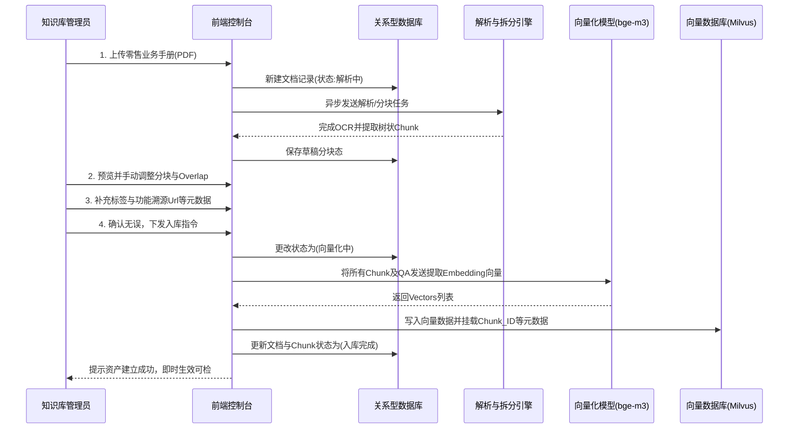

## 1. 产品定位
该系统是“银行AI智能客服问答系统（LLM+RAG）”的核心运营后台。
1. 知识库管理
- 随着新一代问答系统的架构升级，文档在识别解析的基础上还需要进行分块、元数据与标签配置和向量化，且底层知识数据被要求同时保存在关系型数据库、Elasticsearch与向量数据库（如Milvus）中。系统需要对上述过程进行可视化、高可用、可干预的管理，保障大模型底层投喂数据的质量、时效性与准确性。
2. 客户端、行员问答端管理
- 配置客户端、行员问答端的首屏猜你想问等。
3. Badcase管理
- 收集客户、行员对AI问答系统的反馈，并进行分类、分析、修缮。
4. 运营数据统计
- 统计AI问答系统的运营数据，包括但不限于提问量、回答量、命中率、解决率等
5. 权限管理
- 配置不同角色、账号对系统的操作权限。

## 2. 业务目标
  - **流转链路可控**：提供白盒化的文档识别解析、分块、元数据标签配置、向量化流转链路。
  - **精细化干预与纠偏**：允许手动介入修改切片（Chunk）、调整元数据和配置专属标签，保障检索与生成的忠实度。自动/手动配置首屏猜你想问等引导信息。
  - **数据一致性保障**：建立多个数据库之间的数据同步与回滚机制，降低脏数据风险。
  - **提升运营效率**：通过自动化流程和批量操作，减少人工维护成本。

## 3. 用户角色与权限分配
- **系统管理员**：负责系统级参数配置项的设定（如分块策略参数设置、知识库分库配置、权限角色分配）。系统管理员拥有文档管理员的全部权限。
- **文档管理员（各业务条线管理岗）**：负责本条线文档的上架审核、元数据标签体系维护、QA库及相似问的统筹管理。文档管理员拥有文档维护员的全部权限。
- **文档维护员（各业务条线执行岗）**：负责具体的文档上传、处理异常排查、手动切片微调、元数据与标签关联。

## 4. 核心产品功能方案

### 产品架构

|一级|二级|三级|
|---|---|---|
| 工作台 |数据统计||
||待处理事项||
|知识库管理|文档详情|识别与解析|
|||分块|
|||元数据与标签管理|
|||审核|
|||向量化|
|||入库|
|QA库|常规处理||
||相似问管理||
|全局配置|元数据配置||
||标签管理||
||分块策略配置||
||账号与权限配置||
||首屏猜你想问||
|Badcase管理|统计数据||
||Badcase列表||
||Badcase对话详情||

### 工作台

### 知识库文档管理页面
本页面采取左右分栏结构的交互设计：左侧为知识库目录树，右侧为具体文档管理列表。
- **左侧：知识库目录树**
  - **树状目录展示**：按业务条线、组织架构展示树状目录，最大支持三级目录，一级为业务条线，二级为子业务/部门名称（需要与意图体系协同），三级可自定义，二级三级仅为文档管理方便设置，实际文档均属于一级目录知识库
  （如“个人业务” -> “个人贷款业务” -> “个人经营性贷款”下的文档实际均属于“个人业务”知识库）。
  - **目录操作**：支持对目录节点进行新增、重命名、删除及拖拽移动。
    - **目录权限控制**：
        - 一级目录只能由系统管理员进行管理；
        - 所有目录和文档仅允许本条线文档维护员和文档管理员进行管理；
        - 所有目录在删除前需要先删除其下的所有文档。
  - **联动查询**：单击左侧任意目录节点，右侧文档列表自动刷新并展示该节点下的文档资产。

- **右侧：文档列表**
  - **筛选查询**：

    | 筛选项 | 枚举值 ||
    |------|------|---|
    | 搜索框 | 支持按文档名称、文档ID精确或模糊搜索 |
    | 文档状态 |按下拉级联单选进行筛选，枚举值如下： |
    ||识别与解析 | 待解析 / 解析中 / 待校对 / 校对完成 / 解析异常 |
    || 分块状态 | 待分块 / 分块中 / 分块待检查 / 分块检查完成 / 分块异常 |
    || 审核状态 | 待审核 / 审核中 / 审核通过 / 未通过 |
    || 向量化状态 | 待向量化 / 向量化中 / 向量化完成 / 向量化异常 |
    || 入库状态 | 待入库 / 多库同步中 / 多库同步完成 / 同步失败 |

    操作按钮：重置、查询（需支持回车键快捷查询）
    
        
  - **顶部操作栏**：
    - 列表正上方设置【上传文档】按钮（单击呼出上传弹窗，支持拖拽文件）。
      - 上传弹窗内包含：
        - 业务条线选择（下拉框，必填，默认当前目录条线）
        - 文档上传区域（支持拖拽文件）
        - 确认上传按钮
      - 支持格式如下：
        | 格式 | 说明 |
        |------|------|
        | 图片 | 大小上限：100MB 
        | PDF | 大小上限：100MB 
        | Word | 大小上限：100MB 
        | Excel | 大小上限：100MB 
        | PPT | 大小上限：100MB 
        | Markdown | 大小上限：100MB 
        | txt | 大小上限：100MB 

    - 其他：
      - 【批量删除】
      - 【批量解析】
      - 【批量分块】
      - 【批量审核】
      - 【批量向量化】
      - 【批量入库】
      - （视需要可能增加其他按钮）
    
  - **列表字段**：采用行列表格展示，必须至少包含以下字段列：
    - `复选框`
    - `文档ID`（系统底层唯一关联标识，支持一键复制属性）
    - `文档名称`（点击打开新页签、进入文档详情页）
    - `文档版本`（如V1.0、V2.0等）
    - `识别与解析`（展示枚举：待解析 / 解析中 / 待校对 / 校对完成 / 解析异常）
    - `分块状态`（展示枚举：待分块 / 分块中 / 分块待检查 / 分块完成 / 分块异常）
    - `审核状态`（展示枚举：待审核 / 审核中 / 审核通过 / 未通过）
    - `向量化状态`（展示枚举：待向量化 / 向量化中 / 向量化完成 / 向量化异常）
    - `入库状态`（展示枚举：待入库 / 多库同步中 / 多库同步完成 / 同步失败）
    - `文档大小`（单位：MB）
    - `操作列`：根据该行文档所处的状态动态呈现可用按钮，
        | 按钮名称 | 触发状态 | 执行动作 |
        |------|------|------|
        | 文本解析 | 待文本解析 | 调用Paddle OCR 进行文本解析 |
        | 文本校对 | 文本解析完成 | 进入文档详情页校对Tab |
        | 分块 | 校对完成 | 开始进行分块 |
        | 审核（无审核权限不可用）| 向量化完成 | 开始进行审核 |
        | 向量化 | 分块完成 | 开始进行向量化 |
        | 入库 | 向量化完成 | 开始进行入库 |
        | 下载原文（更多选项中） | 任何状态 | 下载原文 |
        | 删除（更多选项中） | 任何状态 | 删除文档 |

          如：已完成识别校对，尚未分块时可点击【分块】进入分块

- **文档版本管理**：
  所有新版上传均为增量保存，即在文档新版本上传后，旧版本依然保留。所有旧版本的删除与其他文档的删除逻辑保持一致。
- **回收站（软删除）**：删除文档时，自动隔离至回收站，并同步向向量数据库发送隔离/删除指令，确保不同数据库数据一致性。

### 知识库文档详情页
文档详情页分为上下两部分，头部为文档名称、各状态显示，下部为进度条，展示详细信息。
#### 头部
文档名称：取文档全称
各状态显示：
|key|value|
|---|---|
| 识别与解析 | 待解析 / 解析中 / 待校对 / 校对完成 / 解析异常 |
| 分块状态 | 待分块 / 分块中 / 分块待检查 / 分块检查完成 / 分块异常 |
|审核状态|待审核 / 审核中 / 审核通过 / 未通过|
| 向量化状态 | 待向量化 / 向量化中 / 向量化完成 / 向量化异常 |
| 入库状态 | 待入库 / 多库同步中 / 多库同步完成 / 同步失败 |

#### 文档处理进度条
进度条分为：
##### 1. 识别与解析
  1. 工具选择

  |类型|工具|说明|URL|APIkey|
  |---|---|---|---|---|
  |PDF|PyMuPDF|无需识别则跳过|工具作为Python库被调用|--|
  |Word|python-docx|无需识别则跳过|工具作为Python库被调用|--|
  |PPT|python-pptx|无需识别则跳过|工具作为Python库被调用|--|
  |图片（内容为文字）|Paddle OCR|无需识别则跳过|http://127.0.0.1:8000/api/|--|
  |表格|Camelot|无需识别则跳过|工具作为Python库被调用|--|
  |文档解析|Unstructured|负责规范化的文本清洗（去除页眉页脚、LOGO文字等），章节层级补充，`Page_Num`提取。|工具作为Python库被调用|--|

  2. 页面布局
  切换至该步骤后，下方区域分为两栏，左侧为文档原文，右侧为识别解析出的文本。
  - 文档解析前，右侧仅展示识别解析按钮；
  - 文档解析后（Markdown），文档状态变为“待校对”，右侧文本框支持编辑，编辑后点击“校对完成”按钮，文档状态变为“校对完成”。自动跳转至下一步骤。
  - 如果解析异常，文档状态变为“文本解析异常”，右侧仅展示错误信息和“重新解析”按钮。

##### 2. 分块
  1. 工具选择
    - 采用父子级分块方式。RAGFlow作为分块工具。
    - 具有明确章节的文档，基于章节进行分块（如一、二、1、a、等层级）。同时，多个末级分块构成一个章节的，需要形成一个父级分块。
    - 不具有明确章节的文档，采用语义分块。
    - 分块间Overlap默认设置为15% （可设置）

  2. 页面布局
  - 切换至该步骤后，下方区域分为两栏，左侧为上一步的解析结果，右侧为分块后的Block/Chunk层级树状图。
  - 如果文档不存在Markdown格式文件，则该Tab不可用。
  - 文档分块前，右侧仅展示分块按钮；
  - 文档分块后，文档状态变为“分块待检查”。
    - **父子分块呈现**：明确呈现文档的章节层级关系（例如：一级标题构成父块，下辖多段正文构成的子块）。
    - **合并/拆分**：遇到解析器将连贯的一句话错误截断时，支持一键合并；遇到单Chunk内容冗长时支持手动划线拆分。
    - **编辑切片文本**：右侧区域支持编辑（通过拖拽分块区域边缘或直接选中文本后，出现“移至上一分块”“移至下一分块”按钮）。或者对OCR识别错误的错别字进行原文修正。
    - **父子级调整**：支持将子级提升为父级，或将父级降级为子级。
    - **Overlap（重叠区）标记**：需标记当前选中分块与前后分块的重合区，方便人工核对语境连贯性。
    - 编辑后点击“分块检查完成”按钮，文档状态变为“分块检查完成”。自动跳转至下一步骤。
    - 右侧下方需展示overlap输入框，默认值为15%，可编辑。
  - 如果分块异常，文档状态变为“分块异常”，右侧仅展示错误信息和“重新分块”按钮。

##### 3. 元数据与标签
  - 切换至该步骤后，下方区域分为两栏，左侧为分块后的文本，右侧为元数据与标签配置。
  - 如果文档未进行分块，则该Tab不可用。
  - 文档元数据与标签配置时，系统自动引用全局默认配置和文档已有元数据（如`Page_Num`），可编辑字段支持编辑。
    - 各字段详情请见：[元数据配置](元数据配置.md) 
    - 下方展示按钮“应用至全文档”，点击后将当前文档的元数据应用至全文档。
    - 标签配置区域中，可新镇标签、删除已有标签。标签体系设计请见：[标签体系](标签体系.md)
    - 下方展示按钮“应用至全文档”，点击后将当前文档的标签应用至全文档。
  - 点击最下方“元数据与标签配置完成”按钮，自动跳转至下一步骤。
  
##### 4. 提交审核（如果是文档管理员、系统管理员则不需要此步骤）
  进入该步骤后，页面展示文档分块，元数据、标签信息。
  操作按钮如下：
    |按钮名称|执行动作|
    |---|---|
    |提交审核|提交给上一级文档管理员审核、进入审核状态|
    |暂存|暂存当前文档|
    |上一步|返回上一个步骤|
    
##### 5. 文档审核（仅文档管理员、系统管理员拥有）
  进入该步骤后，页面展示文档分块，元数据、标签信息。
  操作按钮如下：
    |按钮名称|执行动作|
    |---|---|
    |通过并入库|通过审核、自动进入向量化-入库步骤|
    |仅通过不入库|通过审核、不进入向量化步骤（需弹窗选择入库时间）|
    |驳回|驳回文档、进入驳回原因填写步骤|
    
##### 6. 入库（含向量化）
  1. 工具选择
    - 向量化模型选择：BAAI/bge-m3
    - 向量数据库选择：Milvus

  2. 页面布局
  - 如果审核步骤中选择“通过并入库”，后续向量化、建立向量索引、入库为自动执行，只需提示返回处理状态即可。
  - 如果审核步骤中选择“仅通过不入库”，则页面展示之前设定的入库时间、元数据、标签信息。点击“立即入库”按钮，自动执行后续向量化、建立向量索引、入库操作。
  - 当触发入库后，平台并行调用关系型数据库写入和Milvus向量库写入，建立倒排索引存入Elasticsearch。
  - **重试与告警逻辑**：如果向量化接口超时或Milvus宕机，记录该Chunk状态为“入库异常”，用户可一键“重试”。
  - **单片重向量化**：当上述步骤中人工修改过特定Chunk的文本时，仅针对该独立Chunk重新调用Embedding模型求取向量并局部更新，避免全篇重算的资源浪费。

### QA库
继承与升级已有QA库。将已有旧客服系统的QA库全量平迁为新QA库，每个QA对中的问题（包含相似问）向量化后存入向量数据库，并建立QuestionID，通过QuestionID索引对应答案。
- **QA库管理**：一个知识库对应一个QA库。
- **QA对增删改**：创建一条QA时，系统同时建立倒排索引及向量索引。
- **相似问管理**：一条标准问题可绑定N条相似问，所有相似问均统一映射至同一个底层`Question_ID`。
- **元数据与标签**：QA库也需要元数据与标签，具体请见：[元数据配置说明](元数据配置说明.md) 

### 全局配置
高级参数统一集散中心。
#### 元数据配置
展示当前已经配置的元数据字段及其默认值，可编辑。可添加新的元数据字段。

#### 标签
展示当前已经配置的标签及其默认应用范围，可编辑。可添加新的标签。

#### 分块策略配置
- Overlap配置：默认设置为15%字数的重叠区间，可全局修改。
- 默认单片长度限制：如配置Token阈值（例如单子Chunk不超过 400 tokens / 600汉字）。

#### 账号与权限

#### 外部能力配置
- 配置Paddle OCR服务地址与AK/SK、向量化模型（bge-m3）的Endpoint以及Milvus的连接账号密码。

#### 首页入口配置
- 需区分行员端与客户端：可配置首页推荐问（在QA库中选择），并配置排序权重，前端即刻获取该问题用于入口页面展示（跳过LLM直接通过Question_ID检索答案）。

#### 可配置列表
|路径|配置内容|配置说明|
|---|---|---|

#### 运营栏位配置

### 4.8 负反馈（Badcase）运营闭环体系
- **待处理池**：统一接收来自员工终端或客户评级“踩（不满意）”的日志，呈现原Query、大模型回复和用户填写的“不满意原因”。
- **闭环操作链路**：
  1. 运营人员查看报错，回溯RAG链路日志（是没搜到原文？还是文库本身就写错了？还是大模型归纳总结错了？）。
  2. 提供快捷入口按钮：[前去修改切片(Chunk)] 或 [补充新增标准QA]。
  3. 修改完成后，原Badcase工单标记为“已解决/已修正”。

## 5. 业务流程图示例（知识上传至产生知识资产的全链路）

## 6. 与智能客服系统（前端应用）的集成接口要求
本维护系统作为内容中枢，需向外提供稳定接口：
1. **热更新机制**：当QA数据或Chunk文档数据在维护台“上线/下线”时，前端必须实时生效（或控制在分钟级延迟内）。
2. **首页推荐问题获取接口**：响应被管理员配置为“入口推荐”的特定Question_ID集合及其高频权重序。

## 7. 版本迭代排期建议
| 阶段 | 交付模块 | 目标与资源 |
| --- | --- | --- |
| **一期** | 建立文档解析流水线、实现人工干预分块（Chunk）、元数据手动补录、双库入库管理、存量高频QA结构平迁。 | 保障客服底层数据的无缝衔接与质量达标。 |
| **二期** | 完善多级树状标签管理、Badcase处理流水线深度融合、开放系统配置面板的动态热载功能。 | 降低人工干预率，构建“提问-反馈-优化”自动化数据飞轮。 |

---
*编者：资深AI产品经理团队 \ 日期：2026年3月*
